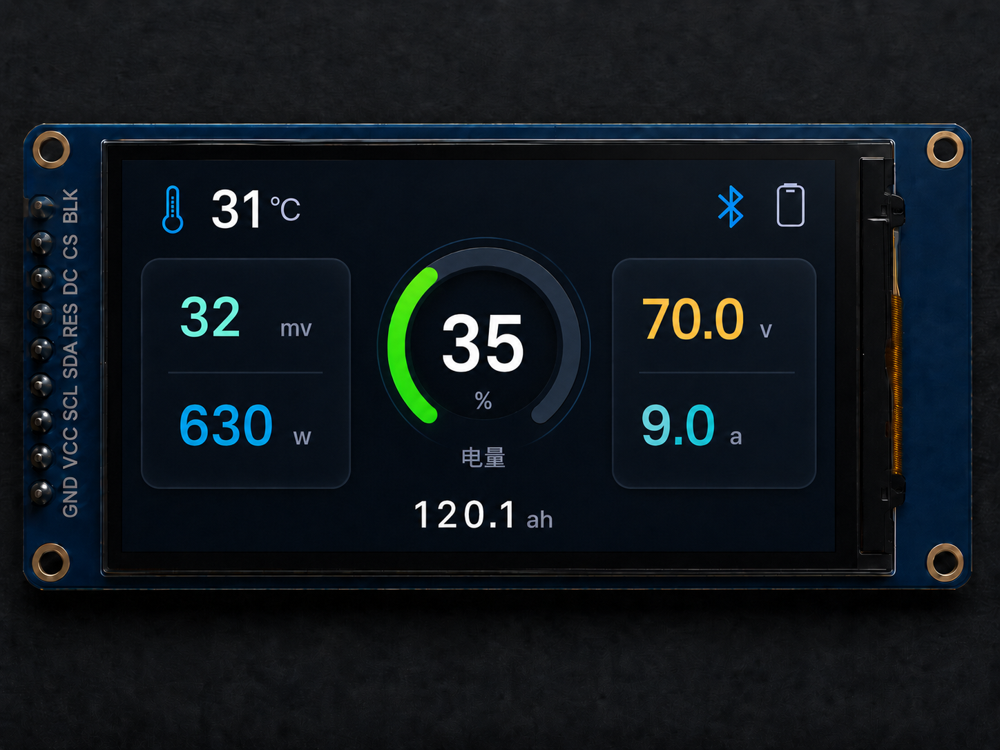

# X仪表

！！！代码未完善，欢迎提交修改
     目前仪表逻辑仅为连接附近信号最强的保护板，不支持自定义选择
     存在连接不稳定和尝试连接保护板的时间过长的问题
X仪表是一款用于查看电池状态的小仪表。通电后会自动连接电池，并在小屏幕上显示常用电池数据。

## 界面预览

## 主要功能

- 开机后自动连接上次使用的电池。
- 如果上次电池未连接成功，会自动搜索附近电池并持续重试。
- 主界面显示电量、温度、功率、压差、电压、电流和剩余容量。
- 顶部图标显示电池连接状态和手机连接状态。
- 连接中显示简洁的动态圆环，方便确认仪表正在工作。
- 未获取到电池数据时会自动重新连接。

## 主界面

- 左上角显示温度。
- 右上角显示蓝牙和手机状态图标。
- 左侧显示压差和功率。
- 中间显示电量圆环。
- 右侧显示电压和电流。
- 底部显示剩余容量。

## 使用提示

- 通电后请等待仪表自动连接电池。
- 如果长时间没有数据，请确认电池已开启并靠近仪表。
- 如果电池刚被其它设备连接，仪表可能需要等待一段时间后重新连接。
